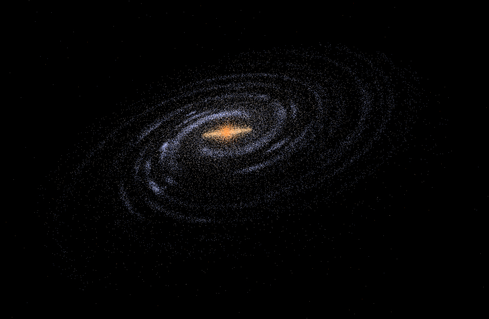

# Galaxy Simulation Project
## A program that can generate simulated galaxies using star values stored in a CSV file
This program uses probability distributions and established properties of real-life galaxies to generate points in a simulated one, containing features that real ones would have such as the disk, bulge, and randomly scattered stars. Running this program would generate a CSV file with 6 columns: XX, YY, ZZ, T, B, S. XX, YY, ZZ refer to the (x,y,z) coordinates of the given star in kpc. T refers to the temperature of the star in Kelvin, B refers to the brightness of the star, and S refers to the star's size. 

### Example of a simulated galaxy: 


### Example usage: 
```bash
# To generate the CSV file, make sure spiral_galaxy.export() is called in the script
# To automatically render the galaxy after generation, make sure spiral_galaxy.render() is called in the script
python3 spiral_galaxy.py

------------- SPIRAL GALAXY GENERATION ------------
... 

Stars exported to spiral_galaxy_stars.csv
```

To render the stars in the CSV file, you may use an external rendering software, or to use the inbuilt one through open3d as shown in the picture above, do as below: 
```bash
python3 render.py <path_to_csv_file>
```